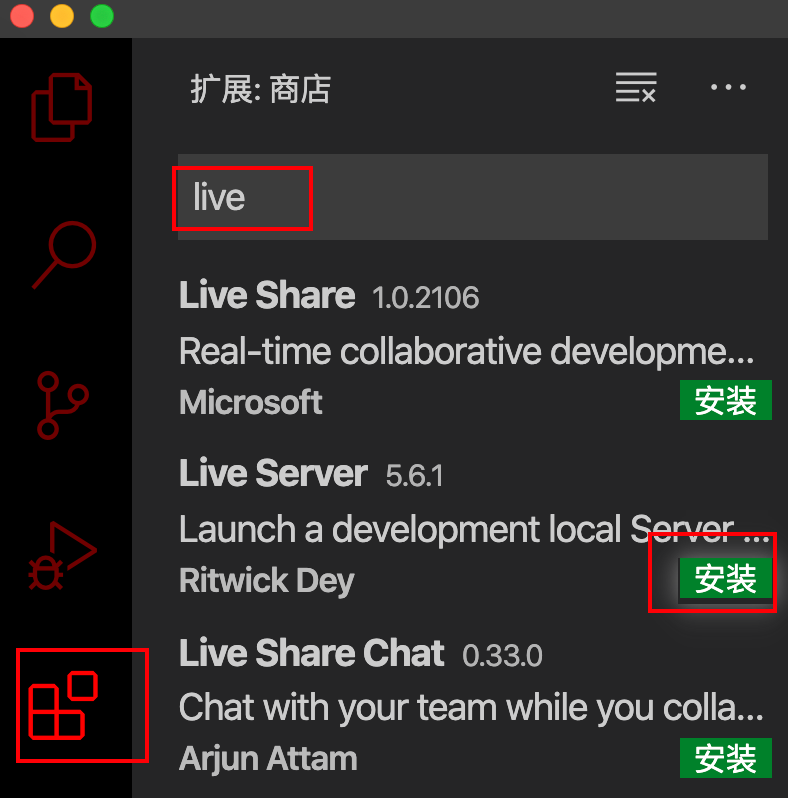
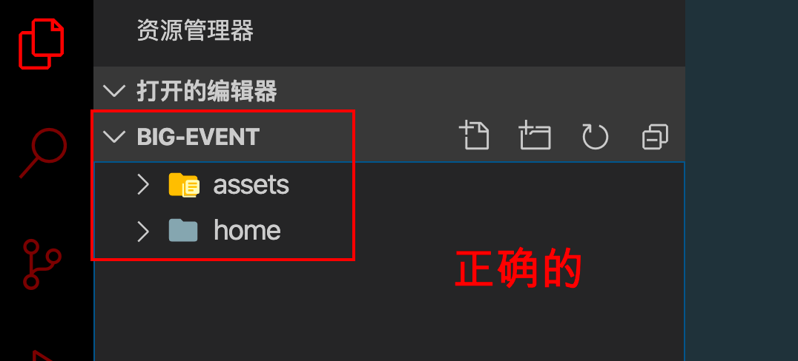
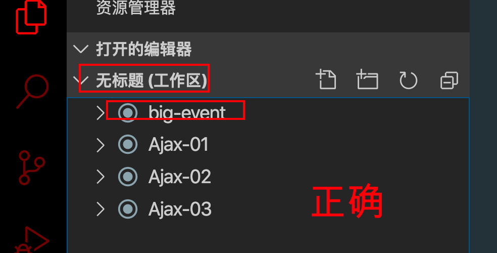
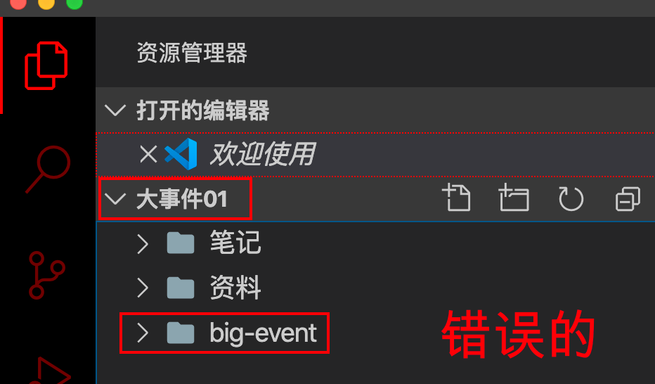
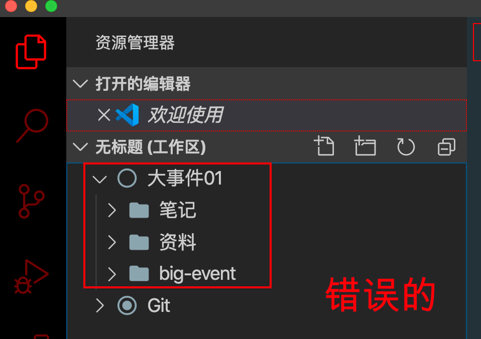
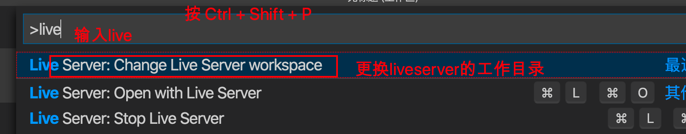
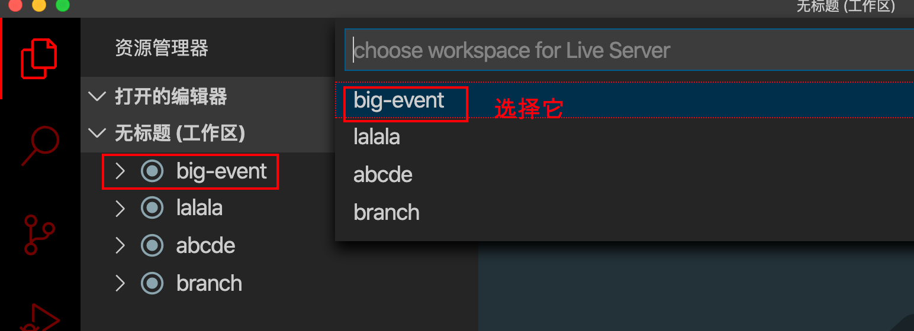
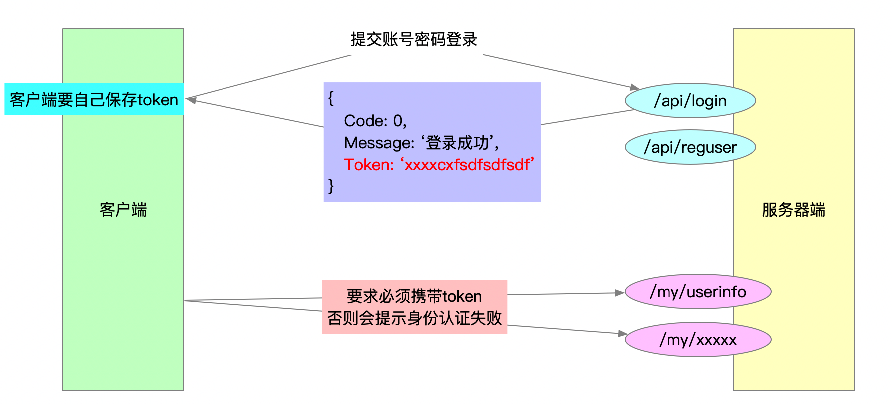

# 搭建项目

## 搭建项目目录

- 创建 `big-event` 文件夹，它就是我们的项目文件夹
- 把 `资料/基础代码` 里面的 `assets` 和 `home` 复制到 `big-event` 里面
- vscode打开 big-event 文件夹

```
|- home
	|- dashboard.html      ---    后台首页图表页面
|- assets
	|- js                  ---    空文件夹，里面准备存放自己写的js文件
	|- css                 ---    空文件夹，里面准备存放自己写的css文件
	|- fonts               ---    存放 iconfont 字体图标的
	|- images              ---    存放的页面布局所需的图片
	|- lib                 ---    存放第三方工具
		|- jquery.js
		|- template-web.js
		|- layui
		|- tinymce         ---    富文本编辑器插件
		|- cropper         ---    图片剪裁插件
```


## 安装插件

vscode中安装 `live-server` 插件。

- 插件可以模拟服务器环境开发
- 页面更新后，可以自动刷新页面

### 安装




### 使用要求

- 要求项目文件夹 `big-event` 要单独出现在vscode侧边栏。

- 正确的做法有下面两种方式

    

    

- 错误的示范

    

    


### 使用 live server 插件打开页面

如果vscode侧边栏只有big-event，那么页面中，直接右键，选择open with live server即可。

如果侧边栏有多个文件夹，按照下面的方式来设置。





设置好之后，打开html页面，右键 --> open with live server。


# 使用Git管理项目

- 初始化   `git init`
- 添加基础的代码 到 暂存区 `git add .`
- 提交代码到本地仓库  `git commit -m '提交了基础的代码'`


# 登录和注册

## 创建文件

在 `big-event` 里面，创建login.html，加载所需的css和js文件

```html
<title>Document</title>
<!-- 无论是css还是js，都需要先加载别人的css和js，最后加载自己的css和自己的js -->
<!-- / 表示服务器根目录，即 big-event 文件夹。只有服务器环境才能使用 / -->

<!-- 加载css文件 -->
<link rel="stylesheet" href="/assets/lib/layui/css/layui.css">
<link rel="stylesheet" href="/assets/css/login.css">
<!-- 加载js文件 -->
<script src="/assets/lib/jquery.js"></script>
<script src="/assets/lib/layui/layui.all.js"></script>
<script src="/assets/js/login.js"></script>
```

## 页面布局

HTML代码：

```html
<!-- logo -->
    <div id="logo">
        
    </div>


    <!-- 登录的盒子 start -->
    <div id="login">
        <!-- 盒子的标题 -->
        <div class="title"></div>
        <!-- 登录的表单 -->
        <form action="" class="layui-form">
            <!-- 第一行：用户名 -->
            <div class="layui-form-item">
                <i class="layui-icon layui-icon-username"></i>
                <input type="text" name="title" required lay-verify="required" placeholder="请输入标题" autocomplete="off"
                    class="layui-input">
            </div>
            <!-- 第二行：密码 -->
            <div class="layui-form-item">
                <i class="layui-icon layui-icon-password"></i>
                <input type="password" name="title" required lay-verify="required" placeholder="请输入标题"
                    autocomplete="off" class="layui-input">
            </div>
            <!-- 第三行：按钮 -->
            <div class="layui-form-item">
                <button class="layui-btn layui-btn-fluid layui-bg-blue" lay-submit lay-filter="formDemo">登录</button>
            </div>
            <!-- 第四行：去注册账号 -->
            <div class="layui-form-item">
                <a href="javascript:;" id="goto-register">去注册账号</a>
            </div>
        </form>
    </div>
    <!-- 登录的盒子 end -->


    <!-- 注册的盒子 start -->
    <div id="register">
        <!-- 盒子的标题 -->
        <div class="title"></div>
        <!-- 登录的表单 -->
        <form action="" class="layui-form">
            <!-- 第一行：用户名 -->
            <div class="layui-form-item">
                <i class="layui-icon layui-icon-username"></i>
                <input type="text" name="title" required lay-verify="required" placeholder="请输入标题" autocomplete="off"
                    class="layui-input">
            </div>
            <!-- 第二行：密码 -->
            <div class="layui-form-item">
                <i class="layui-icon layui-icon-password"></i>
                <input type="password" name="title" required lay-verify="required" placeholder="请输入标题"
                    autocomplete="off" class="layui-input">
            </div>
            <!-- 第三行：重复密码 -->
            <div class="layui-form-item">
                <i class="layui-icon layui-icon-password"></i>
                <input type="password" name="title" required lay-verify="required" placeholder="请输入标题"
                    autocomplete="off" class="layui-input">
            </div>
            <!-- 第四行：按钮 -->
            <div class="layui-form-item">
                <button class="layui-btn layui-btn-fluid layui-bg-blue" lay-submit lay-filter="formDemo">注册</button>
            </div>
            <!-- 第无行：有账号，去登录 -->
            <div class="layui-form-item">
                <a href="javascript:;" id="goto-login">已有账号，去登录</a>
            </div>
        </form>
    </div>
    <!-- 注册的盒子 end -->
```

CSS代码：

```css
html,body {
    height: 100%;
    background: url('/assets/images/login_bg.jpg') no-repeat;
    background-size: cover;
    overflow: hidden;  /* 去掉滚动条 */
}

/* logo */
#logo {
    margin: 20px 0 0 130px;
}

/* 登录和注册的盒子 */
#login, #register {
    height: 310px;
    width: 400px;
    background-color: #fff;
    position: absolute;
    left: 50%;
    top: 50%;
    transform: translate(-50%, -50%);
}

/* 先让注册的盒子隐藏 */
#register {
    display: none;
}

.title {
    height: 60px;
    background: url('/assets/images/login_title.png') no-repeat center;
}

/* 表单 */
.layui-form {
    margin: 0 30px;
}

#goto-register, #goto-login {
    float: right;
}

/* 字体图标 */
.layui-form-item {
    position: relative;
}
.layui-icon {
    position: absolute;
    top: 10px;
    left: 5px;
}
.layui-input {
    padding-left: 25px;
}
```


## 切换登录和注册的盒子

```js
// --------------------- 切换登录和注册的盒子 --------------------
$('.login a').click(function () {
    $('.register').show().prev().hide();
});

$('.register a').click(function () {
    $('.login').show().next().hide();
});
```

## 完成注册的功能

- 注意serialize() 是根据表单项的name属性值获取值的
- 一定要检查表单项的name属性，是否和接口要求的请求参数一致

```js
// ---------------------  注册功能  -----------------------------
// 表单提交，阻止默认行为，收集用户名、密码，ajax提交给注册接口
$('.register form').on('submit', function (e) {
    e.preventDefault();
    // 收集表单数据（一定要按照接口要求来）
    var data = $(this).serialize();
    // console.log(data);
    $.ajax({
        type: 'POST',
        url: 'http://ajax.frontend.itheima.net/api/reguser',
        data: data,
        success: function (res) {
            layer.msg(res.message);
            // 报错，layer is not defined。说明layui.all.js没有加载
            if (res.status === 0) {
                // 注册成功，显示登录的盒子
                $('.login').show().next().hide();
                // 清空注册的表单(reset是dom方法，所以把jQuery对象转成DOM对象)
                $('.register form')[0].reset();
            }
        }
    });
})
```

## 表单验证

### 内置验证规则使用方法

layui提供了表单验证规则。使用方法：

```html
<input type="text" lay-verify="验证规则|验证规则|验证规则" />
```

layui提供了几个内置的验证规则：

- required（必填项）
- phone（手机号）
- email（邮箱）
- url（网址）
- number（数字）
- date（日期）
- identity（身份证）

比如，一个输入框必填、必填保证邮箱格式，代码如下：

```html
<input type="text" lay-verify="required|email" />
```

### 自定义验证规则

layui支持自定义验证规则。

```js
// ---------------------  注册表单验证  -----------------------------
// 1. 用户名、密码、重复密码不能为空
// 2. 密码、重复密码长度 6 ~ 12 位，且不能出现空格
// 3. 密码和重复密码必须一致
// layui自定义验证规则使用步骤：
// 1. 加载form模块 (模块就是layui封装的JS对象;所有模块，使用之前必须先加载，除了layer弹层模块)
// var 变量 = layui.模块名
var form = layui.form;
// console.log(form);
// 2. 调用form.verify()编写验证规则
form.verify({
    // 键（验证规则）: 值（验证的方法，可以使用数组/函数）

    // 使用数组
    // changdu: ['正则表达式', '验证失败时的提示信息']
    changdu: [/^\S{6,12}$/, '长度6~12位，不能有空格'],  // {6,12} 不要写成 {6, 12}

    // 使用函数
    same: function (val) {
        // 形参 val，表示使用验证规则的输入框的值
        // 比如重复密码使用了这个验证规则，形参val表示输入的重复密码
        // 功能代码
        // 获取密码
        var pwd = $('.pwd').val();
        // 比较
        // return，返回的值，就是错误提示信息
        if (pwd !== val) return '两次密码不一致哟~';
    }

});
```

定义完验证规则之后，在HTML页面中，使用该验证规则即可，如下：

```html
<input type="password" lay-verify="required|changdu" />

<input type="password" lay-verify="required|same" />
```

## 完成登录功能

```js
// ---------------------  登录功能  -----------------------------
$('.login form').on('submit', function (e) {
    e.preventDefault();
    // 收集账号、密码
    var data = $(this).serialize();
    // ajax提交
    $.ajax({
        type: 'POST',
        url: 'http://ajax.frontend.itheima.net/api/login',
        data: data,
        success: function (res) {
            if (res.status === 0) {
                // 把token保存到本地存储
                localStorage.setItem('token', res.token);
                // 跳转到index.html
                location.href = '/index.html';
            }
        }
    });
})
```

## 使用layer弹出层

可以直接进入 layer 独立版本演示网站。https://layer.layui.com/

也可以先进入 layui.com 官网，侧边栏 --> 内置模块 --> 弹出层 --> 查看独立版本

选择 提示层，点击之后，代码会自动定位。复制代码直接使用即可。

```js
layer.msg('xxxxx');

layer.msg(res.message);
```

## token的原理

当我们登录成功之后，服务器返回了一个token字符串。

token是一个令牌，访问以 `/my` 开头的接口的时候，必须携带token，否则会提示身份认证失败。

所以，登录成功之后，获取到token，浏览器端（客户端）需要保存token，以便于后续请求使用。




## 本地存储

浏览器内置对象中，有一个叫做 `localStorage` 的对象，翻译过来叫做 本地存储。

通过这个对象，我们可以把一些数据存储到你的计算机中，当然也能够获取出来使用。

- `localStorage.setItem('键', '值');` -- 向本地存储中存一个值
- `localStorage.getItem('键'); `-- 获取本地存储中保存的值
- `localStorage.removeItem('键');`  -- 删除本地存储中保存的值

使用本地存储的注意事项：

- 本地存储，只能存字符串类型、数字型也可以。但是不能直接存对象、数组
    - 如果要存对象，需要把对象 JSON.stringify转成字符串，然后在存 
- 本地存储，存储的内容，会一直存在。不会因为关闭浏览器而丢失，不会因为关机而消失。

## 推送到远程仓库

```bash

# 在码云上创建一个仓库
# 复制ssh地址

# 本地终端中执行
git remote add origin ssh地址
git push -u origin master


# 在github上创建一个仓库（前提是github上也配置好了ssh公钥）
# 复制ssh地址
# 本地终端执行
git remote add abc ssh地址
git push -u abc master
```

## 远程仓库地址

https://gitee.com/laotang1234/bigevent107

https://github.com/Laotang1234/bigevent107