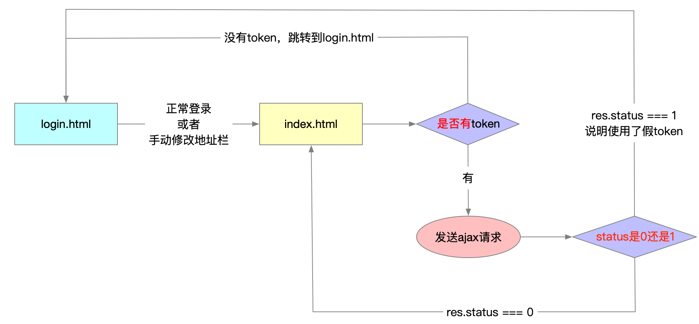
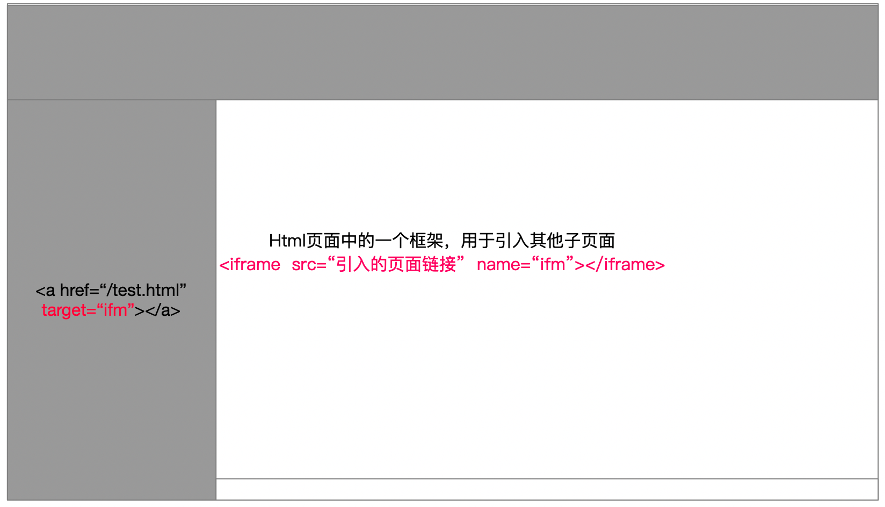

## 回顾

### 本地存储

- 浏览器提供了一套API，可以让我们在计算机中存储一些数据
- API
    - `localStorage.setItem(键, 值)` -- 向本地存储中存一些数据
    - `localStorage.getItem(键)` -- 从本地存储中取一个数据
    - `localStorage.removeItem(键)` -- 从本地存储中删除一个数据
- 特点
    - 本地存储中，只能存字符串，如果希望存一个对象，必须把对象转成字符串
    - 本地存储中的数据会永久保存
    - 一个域的本地存储和另外域的本地存储相互独立，不通用。

### layui的表单验证

- HTML中使用验证规则

    - `<input type="text" lay-verify="验证规则|验证规则|验证规则" />`
    - 上述验证规则，可以使用内置的验证规则，可以使用自定义的验证规则。

- 验证规则

    - 内置验证规则（required、email、number.......）

    - 自定义验证规则 

    - layui内置模块（form）模块，提供了表单验证功能。

        - 如何使用layui的内置模块
            - 使用之前，需要先加载模块
            - `var form = layui.form` -- 加载form模块
            - `var laypage = layui.laypage` -- 加载分页模块
            - .......
        
    - 写验证规则

        ```js
        form.verify({
            键（验证规则）：值（验证方法 数组/函数）
            changdu: [正则表达式, '出错时的提示'],
            same: function (val) {
            	// 函数的形参，表示使用该验证规则的输入框的值
            	// return 错误提示信息
        	}
        })
        ```

- 注意事项

    - form标签，必须有layui-form类。`<form class="layui-form">`
    - 按钮必须有 `lay-submit` 属性


## 后台首页

### 创建文件，加载css和js

- 创建了 /index.html
- 创建了 /assets/css/index.css
- 创建了 /assets/js/index.js

### 页面布局

- 到layui官网，文档-->页面元素-->布局-->后台布局。
- 复制后台布局**全部**的代码，粘贴到你的 index.html 中。
- 修改layui.css 和 layui.all.js 的路径
- 至此，index.html 页面布局基本上就实现了。

> 做完之后，浏览器打开页面，页面的效果能不能实现。

### 头部处理

- 不对的换掉
- 不要的删除

### 侧边栏导航处理

- 自行调整成和线上效果一样的结构（调整顺序）
- 给“首页” 添加 `layui-this` 类，表示默认该项选中
- 去掉 文章管理 的 “`layui-nav-itemed`” 类，刷新后，该项为收缩状态
- 给 ul 添加 `lay-shrink="all"` **属性**，则会出现排他(手风琴)效果。

### 使用字体图标

略

### 头像处理

- 头部的头像和侧边栏的头像一样
- 复制头部区域的 a 标签，放到侧边栏开始的位置，修改a标签为div

- 自定义类。并添加样式，完成最终的效果。

```html
<!-- 侧边栏代码 -->
<div class="userinfo" href="javascript:;">
    
    个人中心
</div>

```

```css
/* 侧边栏的头像位置 div */
div.userinfo {
    height: 60px;
    text-align: center;
    line-height: 60px;
}
```

- 设置欢迎语

```html
<div class="userinfo">
    <span class="text-avatar">A</span>
    
    欢迎你<span class="username">老汤</span>
</div>
```

- 设置文字头像

    因为新注册的账号没有图片类型的头像，所以取用户名的第一个字符当做头像。

    如果后续，用户更换了图片头像，那么就显示图片头像。

    ```html
    <!--    头部  --- 添加 span.text-avatar 标签    -->
    <a class="userinfo" href="javascript:;">
        <span class="text-avatar">A</span>
        
        个人中心
    </a>
    <!--    侧边栏 --- 添加 span.text-avatar 标签   -->
    <div class="userinfo">
        <span class="text-avatar">A</span>
        
        欢迎你<span class="username">老汤</span>
    </div>
    ```
    
```css
/* 字体头像 */
.text-avatar {
    width: 32px;
    height: 32px;
    text-align: center;
    line-height: 32px;
    font-size: 20px;
    color: #fff;
    background-color: #419488;
    display: inline-block;
    border-radius: 50%;
}

/* 默认隐藏两个头像 */
.text-avatar, .layui-nav-img {
    display: none;
}
```


### 登录之后，获取用户信息并渲染

> 开发之前，记得把jQuery和自己的js先加载好

- 封装一个函数 `getUserInfo()`，完成ajax请求，获取用户信息并渲染
-  `getUserInfo()` 函数要放到入口函数外部
    - 封装成函数，后续，其他页面会使用
- 发送请求的时候，必须在请求头中，携带token
- 渲染
    - 设置欢迎语
        - 优先使用昵称，没有昵称则使用登录账号
    - 设置头像
        - 优先使用图片，没有图片，则使用名字的第一个字符
        - 设置字体头像的时候，不要用show()方法，要自己设置css样式

```js

function getUserInfo() {
    $.ajax({
        // type: 'GET', // type不填，默认就是GET
        url: 'http://www.liulongbin.top:3007/my/userinfo',
        success: function (res) {
            if (res.status === 0) {
                // 1、设置欢迎语（有昵称，就使用昵称，没有昵称，使用用户名）
                var myname = res.data.nickname || res.data.username;
                $('.myname').text(myname);
                // 2、设置头像（有图片，使用图片；没有图片，使用名字的首字母）
                if (res.data.user_pic) {
                    // 使用图片
                    $('.layui-nav-img').attr('src', res.data.user_pic).show();
                    $('.text-avatar').hide();
                } else {
                    var t = myname.substr(0, 1).toUpperCase();
                    // jQuery中的show方法，会设置元素 display:inline;
                    $('.text-avatar').text(t).css('display', 'inline-block');
                    $('.layui-nav-img').hide();
                }
            }
        },
        // jQuery中ajax选项，有一个headers，通过他，可以设置请求头
        headers: {
            'Authorization': localStorage.getItem('token')
        }
    });
}
```


### 退出功能

- 退出超链接
    - 加入 id="logout"
    - href="javascript:;"    这点一定要注意，必填
- 点击退出
    - 询问
    - 删除token
    - 跳转到 login.html

```js
// --------------  退出功能 ---------------------
// 退出的时候，两个操作
// - 删除token
// - 页面跳转到登录页面
$('#logout').click(function () {
    // 弹出层，询问是否要退出
    layer.confirm('你确定退出吗？你退出了还得登录，你想好了吗？', function (index) {
        //do something
        // 如果点击了确定，删除token，页面跳转
        localStorage.removeItem('token');
        location.href = '/login.html';
        layer.close(index); // 关闭当前弹出层
    });

});
```


### 控制用户必须登录才能访问index.html

- 思路

    - 根据token来判断（没有token，则跳转到login.html）

        - 在 `index.html` 中，加入如下判断

            ```html
            <script>
              if (!localStorage.getItem('token')) {
                location.href = '/login.html';
              }
            </script>
            ```

            > 这种判断，适用于控制大部分用户

    - 根据ajax请求结果来判断

        - 获取用户信息之后，根据服务器返回的结果，判断

        ```js
        // complete函数，在ajax请求完成（无论成功还是失败）之后触发
        complete: function (xhr) {
            // 这里判断身份认证是否成功
            // console.log(xhr);
            if (xhr.responseJSON && xhr.responseJSON.status === 1 && xhr.responseJSON.message === '身份认证失败！') {
                // 删除假token
                localStorage.removeItem('token');
                // 跳转到登录页面
                location.href = '/login.html';
            }
        },
        ```
        




## 统一配置url、headers、complete

- 所有接口都需要配置url
- 包含 `/my/` 的接口，还需要配置headers和complete
- 配置之后，别忘记在html中引入common.js
- 修改url为简短的url
- index.js中去掉 headers和complete

```js
// 统一配置项目的ajax请求

$.ajaxPrefilter(function (option) {
    // option表示ajax选项

    // 1. url统一配置（所有接口都需要配置）
    option.url = 'http://ajax.frontend.itheima.net' + option.url;

    // 完整的url    http://ajax.frontend.itheima.net/my/userinfo
    if (option.url.includes('/my/')) {
        // 2. headers，请求头加token（是以 /my 开头的 接口，需要这个配置）
        option.headers = {
            Authorization: localStorage.getItem('token')
        }
        // 3. ajax请求完成之后，判断token的真假（是以 /my 开头的 接口，需要这个配置）
        option.complete = function (xhr) {
            // ajax请求完成，根据服务器返回的结果判断token的真假
            if (xhr.responseJSON && xhr.responseJSON.status === 1 && xhr.responseJSON.message === '身份认证失败！') {
                // 说明token是假的或者过期的
                // 1. 删除假token
                localStorage.removeItem('token');
                // 2. 跳转到登录页面
                location.href = '/login.html';
            }
        }
    }

});
```


## 首页内容区说明

使用iframe标签

- iframe标签是HTML标签
- iframe在整个页面（父页面）中，占用一个区域，这个区域可以引入其他（子）页面
- src属性用于引入默认的子页面
- 侧边栏的 a 标签，href属性正常挂链接
- 侧边栏的 a 标签，target属性，表示打开新页面的位置；
- 通过指定 `target=“iframe标签的name值”` ，可以在iframe区域打开链接的页面




## 个人中心

### 思路：

- html放到user文件夹
- css，也要放到 /assets/css/**user**/ 这里
- js，也要放到 /assets/js/**user**/ 这里

### 基本资料

- 准备工作

    - 先创建三个文件（html、css、js）
    - index.html 侧边栏和头部挂好连接
    - 加载所需的文件

    ```html
    <!-- userinfo.html  -->
    <!DOCTYPE html>
    <html lang="en">
    <head>
        <meta charset="UTF-8">
        <meta name="viewport" content="width=device-width, initial-scale=1.0">
        <title>Document</title>
        <link rel="stylesheet" href="/assets/lib/layui/css/layui.css">
        <link rel="stylesheet" href="/assets/css/user/userinfo.css">
    </head>
    <body>
        
    
        <script src="/assets/lib/jquery.js"></script>
        <script src="/assets/lib/layui/layui.all.js"></script>
        <script src="/assets/js/common.js"></script>
        <script src="/assets/js/user/userinfo.js"></script>
    </body>
    </html>
    ```

- 页面布局

    - 略

- 功能一：数据回填

    - 封装函数 `renderForm` 
    - 函数里面，发送ajax请求，获取用户信息
    - 获取用户信息成功后，做数据回填
        - 设置input的默认的value值
        - 注意隐藏域id，一定要写。因为后续修改的时候，接口需要id的

    ```js
    // ------------------------- 1. 数据回填 -------------------------
    // 定义渲染表单的函数
    function renderForm () {
        // 发送ajax请求，获取该用户的信息
        $.ajax({
            url: '/my/userinfo',
            success: function (res) {
                console.log(res);
                // 设置每个input的value值（用户名、昵称、邮箱、id）
                $('input[name=username]').val(res.data.username);
                $('input[name=nickname]').val(res.data.nickname);
                $('input[name=email]').val(res.data.email);
                $('input[name=id]').val(res.data.id);
            }
        });
    }
    renderForm();
    ```

- 功能二：点击确认修改按钮，完成修改

    - 找到表单，注册submit事件，阻止默认行为
    - 收集表单数据
    - ajax提交数据，完成修改
    - 修改后，调用父页面的 getUserInfo() 渲染欢迎语位置

    ```js
    // ------------------------- 2. 点击确认修改按钮，完成修改 ----------
    $('form').on('submit', function (e) {
        e.preventDefault();
        // 收集表单数据
        var data = $(this).serialize();
        // console.log(data);
        // ajax提交给接口，完成用户信息修改
        $.ajax({
            type: 'POST',
            url: '/my/userinfo',
            data: data,
            success: function (res) {
                // console.log(res);
                layer.msg(res.message);
                if (res.status === 0) {
                    // 修改用户信息成功，重新渲染index.html页面
                    // 调用父页面的 getUserInfo() 函数。
                    // 因为 iframe，把 userinfo.html  和 index.html 确认为父子页面
                    // 有父子关系的页面才能这样用。
                    window.parent.getUserInfo();
                }
            }
        });
    })
    ```

- 查漏补缺

    - 表单验证，给邮箱，加入email验证规则即可
    - 设置用户名禁用
        - 设置之后，不能通过serialize收集到该项数据了
    - 重置表单（今天没讲到）
    - layui的快速为表单赋值（今天没讲到）

### 重置密码

### 更换头像