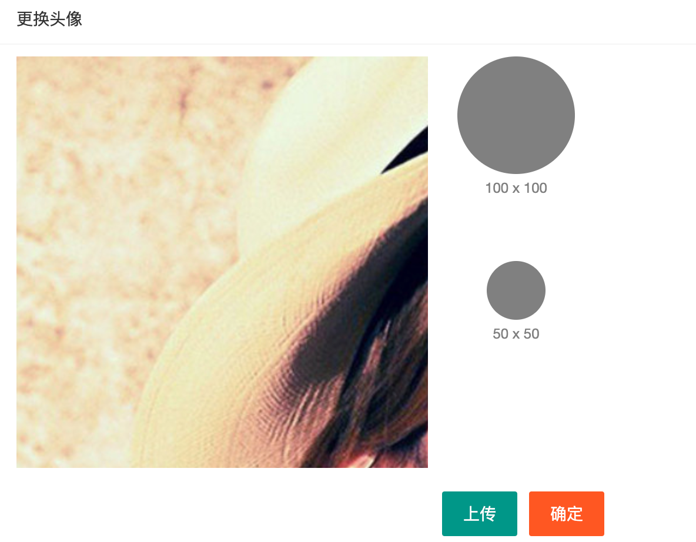

# 大事件-03

## 基本资料

### 准备工作

- 创建HTML文件、css文件、js文件
    - 创建 /user/userinfo.html
    - 创建 /assets/css/userinfo.css
    - 创建 /assets/js/user/userinfo.js
- index.html 头部和侧边栏，挂超链接，链接到 /user/userinfo.html，注意target="fm"

### 页面布局

略（因为是复制过来的）

只需要修改一下页面中的文字、修改一下类名、name属性值等等

- 修改了input的name属性值（分别是username、nickname、email）
- 设置登录账号这个input disable属性，因为修改的时候，不允许修改登录账号
- 给邮箱加一个email验证规则

### 为表单赋值

> 修改页面的js文件，为userinfo.js

思路：

- 发送ajax请求，获取用户信息
- 设置表单各项（每个输入框）的value值。

具体步骤：

- 需要在 form 中，添加一个隐藏域，用于保存id值，前面已经添加过了

    ```html
    <input type="hidden" name="id" />
    <!-- 隐藏域，只要放到 form 里面即可 -->
    ```

- 先设置表单各项的 name 属性（username/nickname/email/id）

- 发送ajax请求，获取用户信息

- 使用layui的from模块快速为表单赋值

    - 为表单设置 `lay-filter="user"` ，值随便定义，我这里使用的是 user
    - JS代码中，一行代码为表单赋值

    ```js
    let form = layui.form;
    form.val('user', res.data);
    ```

    - `要求，res.data 这个对象的属性（key）要和表单各项的name属性值相同，才能赋值`

> 只要是修改操作：
>
> 1. 必须要进行数据回填操作，保证输入框是有值的
> 2. 修改的表单中，必须要有隐藏域 id

### 完成更新用户信息的功能

- 设置 登录账号为 `disabled` 
    - 不允许修改
    - 通过 $('form').serialize() 不能获取到 username 值，刚刚好是我们的需要。
- 注册表单的提交事件
- 阻止默认行为
- 收集表单数据，使用 $('form').serialize() 。（id、nickname、email）
- 发送ajax请求，完成更新
- 更新成功之后，提示，并且调用父页面的 `getUserInfo()` 从新渲染用户的头像

```js
// ------------------   表单提交的时候，完成用户信息的更新 -----------------
// 监听表单的提交事件。
$('form').on('submit', function (e) {

    // 阻止默认行为
    e.preventDefault();
    // 获取id、nickname、email的值
    var data = $(this).serialize();
    // console.log(data);
    // ajax提交给接口，从而完成更新
    $.ajax({
        type: 'POST',
        url: '/my/userinfo',
        data: data,
        success: function (res) {
            // 无论成功还是失败，都要提示
            layer.msg(res.message);
            if (res.status === 0) {
                window.parent.getUserInfo();
            }
        }
    });
});
```


### 重置表单

```js
// ---------------------  重置表单  -------------------------
$('button:contains("重置")').click(function (e) {
    e.preventDefault();
    renderForm(); // 调用renderForm()，为表单重新赋值，就可以恢复成原样
});
```


## Git忽略文件

在项目根目录中，创建 `.gitignore` 文件，它就是git的忽略文件。

```bash
# 井号是注释

# git的忽略文件

# 设置node_modules文件夹为忽略文件
node_modules

# 设置package-lock.json为忽略文件
package-lock.json

# 设置其他文件为忽略文件
iframe.html

test.html

test.js

test2.html
```

设置忽略文件之后，被忽略的文件，git就不再对它进行管理了。

如果一个文件，已经被提交过了，需要先删除文件，命令是 `git rm -r --cached 文件名` ，如果不加 `--cached` ,会把文件直接从工作区和暂存区同时删除。

## 更新密码

### 准备工作

- 创建所需的HTML、js文件、css文件
    - 经过观察，所有小页面的布局都一样，所以这里可以使用base.css
    - 在 /assets/css 里面创建 base.css （只规定body的背景色、卡片布局的边距）
- 首页侧边栏和头部区域挂好链接
    - href=“/user/repwd.html”
    - target="fm"    fm是iframe的name属性值
- 加载好所需的css和js文件

```html
<!DOCTYPE html>
<html lang="en">
<head>
    <meta charset="UTF-8">
    <meta name="viewport" content="width=device-width, initial-scale=1.0">
    <title>Document</title>
    <link rel="stylesheet" href="/assets/lib/layui/css/layui.css">
    <!-- 因为重置密码页面和基本资料页面样式一样 -->
    <link rel="stylesheet" href="/assets/css/userinfo.css">
</head>
<body>
    
    <!--
	1. html代码，去userinfo.html 中复制
	2. 修改文字
	3. 去掉第一个输入框的 disabled 属性
	4. 去掉 隐藏域id
	5. 修改原密码的name属性为 oldPwd；修改新密码的name为 newPwd；去掉重复密码的name属性
	-->
    
    <script src="/assets/lib/jquery.js"></script>
    <script src="/assets/lib/layui/layui.all.js"></script>
    <script src="/assets/js/common.js"></script>
    <script src="/assets/js/user/repwd.js"></script>
</body>
</html>
```


### 表单验证

```js
// --------------------- 1. 表单验证 ------------------------
// 1) 长度6~12位，不能有空格 （两个新密码都要用）
// 2) 新密码不能和原密码相同
// 3) 两次新密码必须一致

// 加载 layui 的 form 模块
var form = layui.form;
// 自定义验证规则
form.verify({
    // 1) 长度6~12位，不能有空格
    len: [/^\S{6,12}$/, '密码长度必须是6~12且不能有空格'],

    // 2) 新密码不能和原密码相同
    diff: function (val) {
        // 形参表示使用该验证规则的输入框的值，新密码使用这个验证规则，所以val表示填写的新密码
        // 获取原密码
        var oldPwd = $('input[name=oldPwd]').val();
        if (val === oldPwd) {
            return '新密码不能和原密码相同';
        }
    },


    // 3) 两次新密码必须一致 (重复密码 用这个验证规则)
    same: function (val) {
        // val 表示填写的重复密码
        // 获取新密码
        var newPwd = $('input[name=newPwd]').val();
        if (newPwd !== val) {
            return '两次密码不一样哟~';
        }
    }
});
```

- 三个密码框，都使用len这个验证规则
- 新密码，使用diff，这个验证规则
- 确认密码，使用 same 验证规则


### ajax请求，完成更新

```js
// 监听表单的提交事件
$('form').on('submit', function (e) {
    e.preventDefault();
    var data = $(this).serialize(); // serialize是根据表单input的name属性值获取值的，所以一定要检查name属性值
    $.post('/my/updatepwd', data, function (res) {
        // 无论修改成功还是失败，都给出提示
        layer.msg(res.message);
        if (res.status === 0) {
            // 修改成功，清空输入框的值
            $('form')[0].reset(); // DOM方法reset表示重置表单
        }
    });
});
```

## 更换头像

### 准备工作

- 创建文件

    - 创建 /user/avatar.html 
    - 创建 /assets/css/user/avatar.css 
    - 创建 /assets/js/user/avatar.js

- index.html 中，侧边栏和头部区域挂好超链接

- avatar.html 中 引入所需的css和js文件

    ```html
    <!-- 加载layui.css -->
    <link rel="stylesheet" href="/assets/lib/layui/css/layui.css">
    <!-- 加载cropper.css -->
    <link rel="stylesheet" href="/assets/lib/cropper/cropper.css">
    <!-- 加载自己的css -->
    <link rel="stylesheet" href="/assets/css/user/avatar.css">
    
    
    
    <!-- 加载jQuery -->
    <script src="/assets/lib/jquery.js"></script>
    <!-- 加载layui.all.js -->
    <script src="/assets/lib/layui/layui.all.js"></script>
    <!-- 按顺序 加载Cropper.js -->
    <script src="/assets/lib/cropper/Cropper.js"></script>
    <!-- 按顺序 jquery-cropper.js -->
    <script src="/assets/lib/cropper/jquery-cropper.js"></script>
    <!-- 加载common.js -->
    <script src="/assets/js/common.js"></script>
    <!-- 加载avatar.js -->
    <script src="/assets/js/user/avatar.js"></script>
    ```
    
    

### 复制HTML和CSS（完成布局）

- 首先，得有一个卡片面板布局（去layui复制）

    ```html
    <div class="layui-card">
      <div class="layui-card-header">卡片面板</div>
      <div class="layui-card-body">
        卡片式面板面板通常用于非白色背景色的主体内<br>
        从而映衬出边框投影
      </div>
    </div>
    ```

- 去 “cropper的基本用法.md” 笔记中，复制代码（html和css），放到卡片布局的内容区。

- 完成后的效果：




### 创建剪裁区(初始化剪裁区)

- 使用插件 cropper ，提供的方法，实现剪裁区的创建
- 具体做法：
    - 找到剪裁区的图片 （img#image）
    - 设置配置项
    - 调用cropper方法，创建剪裁区

```js
// ---------------  创建剪裁区 ------------------
// - 找到剪裁区的图片 （img#image）
var $image = $('#image');
// - 设置配置项
var option = {
    // 纵横比(宽高比)
    aspectRatio: 1, // 正方形
    // 指定预览区域
    preview: '.img-preview' // 指定预览区的类名（选择器）
};
// - 调用cropper方法，创建剪裁区
$image.cropper(option);

```


### 点击按钮，可选择图片

- html中加入一个隐藏的文件域
- 点击上传按钮的时候，触发文件域的单击事件

```html
<!-- 加一个隐藏的文件域 -->
<input type="file" id="file" style="display: none;" accept="image/*">
<button type="button" class="layui-btn">上传</button>

```

```js
// -------------  点击  上传  ，可以选择图片  ------------
$('button:contains("上传")').click(function () {
    $('#file').click();
});

```


### 更换图片，重置剪裁区

- 找到选择的文件（文件对象）
- 为文件对象创建一个临时的url
- 更换剪裁区的图片
    - 先销毁原来的剪裁区
    - 更改图片的src属性
    - 重新生成剪裁区

```js
// 文件域的内容改变的时候，更换剪裁区的图片
$('#file').change(function () {
    // 3.1) 先找到文件对象
    // console.dir(this)
    var fileObj = this.files[0];
    // 3.2) 为选择的图片生成一个临时的url
    var url = URL.createObjectURL(fileObj);
    // console.log(url);
    // 3.3) 更换图片的src属性即可（销毁剪裁区 --> 更换src属性 --> 重新创建剪裁框）
    $image.cropper('destroy').attr('src', url).cropper(option);
});

```


### 点击确定，实现剪裁并修改头像

- 调用 cropper 方法，传递 `getCroppedCanvas` 参数，得到一个canvas图片（对象）
- 调用canvas的toDataURL()方法，得到base64格式的图片
- ajax提交即可

```js
// ------------- 4. 点击确定按钮，剪裁图片，把图片转成base64格式，ajax提交字符串，完成更换 ----
$('button:contains("确定")').click(function () {
    // 4.1）调用插件方法，剪裁图片；剪裁之后得到一张canvas格式的图片
    var canvas = $image.cropper('getCroppedCanvas', {
        width: 100,
        height: 100
    });
    // 4.2) 把canvas图片转成base64格式，得到超长字符串
    var base64 = canvas.toDataURL('image/png');
    // console.log(base64);
    // 4.3) ajax提交字符串，完成更新
    $.ajax({
        type: 'POST',
        url: '/my/update/avatar',
        data: { avatar: base64 },
        success: function (res) {
            layer.msg(res.message);
            if (res.status === 0) {
                // 重新渲染父页面的头像
                window.parent.getUserInfo();
            }
        }
    });
});
```

### 关于base64格式的图片说明

- base64格式只是图片的一种格式，用字符串表示图片的格式
- base64格式的优点：减少http请求，加快小图片的响应速度，减轻服务器的压力
- base64格式的缺点：体积比正常图片大 30% 左右。
- 如果是小图片，可以使用base64格式，大图片不建议使用了。

> https://www.css-js.com/tools/base64.html


## 类别列表

### 复制之前写好的代码

- 之前写好的代码在 `Ajax06` 里面
- big-event中，创建对应的各个文件
    - /**article**/category.html
    - /assets/css/**article**/category.css
    - /assets/js/**article**/category.js
- 复制原来的html、css、js代码分别到上述三个文件中
- 修改category.html 里面的路径
    - 修改加载的css和js的路径
- index.html 侧边栏挂好链接即可。

- 将代码提交


## 文章列表

### 准备工作

- 创建文件

    - /article/article.html
    - /assets/css/article/article.css
    - /assets/js/article/article.js

- 加载所需的css和js

    ```html
    <!DOCTYPE html>
    <html lang="en">
    <head>
        <meta charset="UTF-8">
        <meta name="viewport" content="width=device-width, initial-scale=1.0">
        <title>文章列表</title>
        <link rel="stylesheet" href="/assets/lib/layui/css/layui.css">
        <link rel="stylesheet" href="/assets/css/article/article.css">
    </head>
    <body>
        
        sdfsdf
        <script src="/assets/lib/jquery.js"></script>
        <script src="/assets/lib/template-web.js"></script>
        <!-- 必须加载layui.all.js，因为页面中用到了很多layui提供的功能，比如弹层 -->
        <script src="/assets/lib/layui/layui.all.js"></script>
        <!-- 加载自己的js文件 -->
        <script src="/assets/js/common.js"></script>
        <script src="/assets/js/article/article.js"></script>
    </body>
    </html>
    ```

- index.html 侧边栏挂好链接

### 页面布局

- 卡片面板
    - 表单搜索区
        - 页面元素 --> 表单 --> 组装行内表单
    - 表格内容区
        - 略
    - 分页区
        - 一个空div即可


### 实现文章列表功能

- 每个人只能看到自己发布的文章。不能看到其他同学发布的文章。
- 使用自己的账号，到线上演示地址登录，然后发表几篇文章。这样就可以看到自己发布的文章了。

```js
// ----------------------  ajax获取文章列表，渲染到页面中 --------------------
function renderArticle () {
    $.ajax({
        url: '/my/article/list',
        data: {
            pagenum: 1, // 页码值
            pagesize: 5, // 每页显示多少条数据
            // cate_id: 
            // state: 
        },
        success: function (res) {
            // console.log(res); // 和分类不一样，自己只能看到自己发布的文章
            // 把结果渲染到页面中
            var html = template('tpl-article', res);
            $('tbody').html(html);
        }
    });
}
renderArticle();
```

```html
<!-- 文章列表模板 start -->
    <script id="tpl-article" type="text/html">
        {{each data val}}
        <tr>
            <td>{{val.title}}</td>
            <td>{{val.cate_name}}</td>
            <td>{{val.pub_date}}</td>
            <td>{{val.state}}</td>
            <td>
                <button type="button" class="layui-btn layui-btn-xs edit">编辑</button>
                <button type="button" class="layui-btn layui-btn-xs layui-btn-danger delete">删除</button>
            </td>
        </tr>
        {{/each}}
    </script>
    <!-- 文章列表模板 end -->
```

### 筛选下拉框

- **处理两个下拉框**

    - 第一个下拉框

        - 设置id=“category”

        - 发送ajax请求，获取所有的分类，渲染到select位置

        - 渲染之后，要调用 `form.render('select')` 更新渲染。

        - JS代码：

            ```js
            // ------------------- 2. 发送ajax请求，获取所有分类 --------------------
            // 获取到所有分类之后，渲染到页面 下拉框 位置
            $.ajax({
                url: '/my/article/cates',
                success: function (res) {
                    if (res.status === 0) {
                        // console.log(res);
                        // 使用模板引擎渲染到 下拉框 位置
                        var html = template('tpl-category', res);
                        $('#category').html(html);
                        // 更新渲染
                        form.render('select');
                    }
                }
            });
            ```

        - HTML模板代码：

            ```html
            <!-- 下拉框的分类模板 start -->
            <script type="text/html" id="tpl-category">
                <option value="">所有分类</option>
            
                {{each data val}}
                <option value="{{val.Id}}">{{val.name}}</option>
                {{/each}}
            </script>
            <!-- 下拉框的分类模板 end -->
            ```

            

    - 第二个下拉框

        - 设置id=“state”
        - 手动修改，添加 已发布 和 草稿两个状态

        ```html
        <select id="state" lay-verify="">
            <option value="">所有状态</option>
            <option value="已发布">已发布</option>
            <option value="草稿">草稿</option>
        </select>
        ```

        

### layui的分页模块

layui官网 -- 文档 -- 内置模块 -- 分页（laypage）

```js
// ------------------- 3. layui的分页模块 ----------------------------
function createPage () {
    laypage.render({
        elem: 'page', // 这里的page是页面中div的id
        count: 50, // 数据总数，从服务端得到文章总数
        limit: 8, // 每页显示多少条，默认是 10。实际开发中，应该让它和 data.pagesize 一致
        limits: [2, 3, 5, 8], // 自定义每页显示多少条 的 下拉菜单
        curr: 1, // 当前页。实际中，它应该和 data.pagenum 一致
        // prev: '<<'
        layout: ['count', 'limit', 'prev', 'page', 'next', 'skip'], // 自定义排版
        // 课下了解
        jump: function (first, obj) {
            console.log(123);
        }
    });
}

createPage();
```

