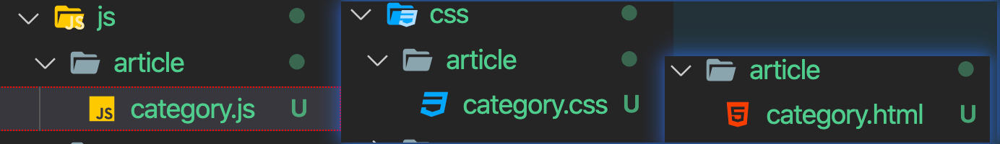
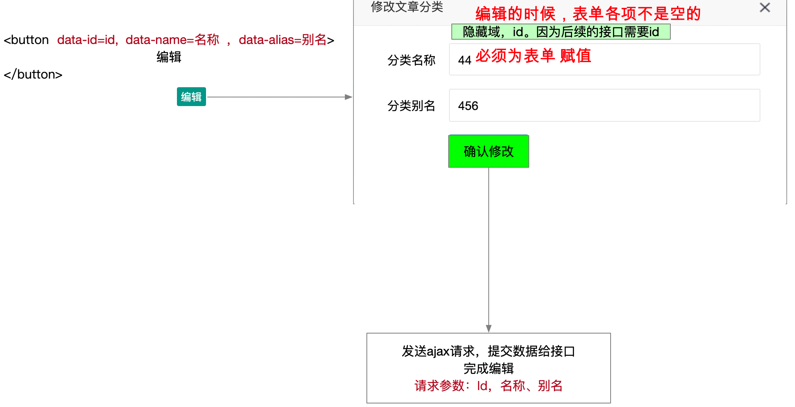

# 类别管理（参考笔记）

## 类别列表（参考笔记）

### 准备工作

- 创建文件
    - /article/category.html
    - /assets/css/article/category.css
    - /assets/js/article/category.js
    
    
    
    
    
- index.html 侧边栏挂超链接

- category.html 加载所需的css和js

```html
<title>文章类别管理</title>
<link rel="stylesheet" href="/assets/lib/layui/css/layui.css">
<link rel="stylesheet" href="/assets/css/article/category.css">

<script src="/assets/lib/jquery.js"></script>
<script src="/assets/lib/layui/layui.all.js"></script>
<!-- 加载模板引擎 -->
<script src="/assets/lib/template-web.js"></script>
<script src="/assets/js/common.js"></script>
<script src="/assets/js/article/category.js"></script>
```


### 页面布局

css样式：

```css
body {
    background-color: #f2f3f5;
}

.layui-card {
    margin: 15px;
}

.layui-card-header {
    display: flex;
    justify-content: space-between;
    align-items: center;
}
```

### ajax请求类别列表数据

```js
function renderCategory () {
    $.ajax({
        url: '/my/article/cates',
        success: function (res) {
            // console.log(res);
            // 调用template函数，把模板和数据组合到一起
            var str = template('tpl-category', res);
            // var str = template('tpl-category', {
            //     status: 0,
            //     message: 'chengg',
            //     data: [各项数据]
            // });
            // 把组合后的HTML标签，放到指定的位置
            $('tbody').html(str);
            // $('tbody').html(template('tpl-category', res));
        }
    });
}
```


### 模板引擎渲染页面

```html
<!-- 类别列表模板  start -->
<script type="text/html" id="tpl-category">
    {{each data val}}
    <tr>
        <td>{{val.name}}</td>
        <td>{{val.alias}}</td>
        <td>
            <button type="button" class="layui-btn layui-btn-xs">编辑</button>
            <button type="button" class="layui-btn layui-btn-xs layui-btn-danger">删除</button>
        </td>
    </tr>
    {{/each}}
</script>
<!-- 类别列表模板  end -->
```


## 添加类别（参考笔记）

### 初步使用弹出层

- 给 “添加分类” 绑定一个单击事件
- 单击事件中，使用 layer.open() 实现一个弹出层
    - type: 1, 弹层的类型是页面层
    - title, "添加文字分类"
    - content: '字符串，DOM',
    - area: ['500px', '250px']

### 弹层的内容区，使用DOM

我们可以在html页面中，先准备一个模板（比如id=“tpl-add”）。然后open方法的content选项，我们使用 $('#tpl-add').html()

js代码：

```js
// --------------- 点击 添加类别 ，弹层 ---------------------
    $('.layui-card-header button').click(function () {
        layer.open({
            type: 1,
            title: '添加类别',
            content: $('#tpl-add').html(),
            area: ['500px', '250px']
        });
    });
```

html中，添加的模板

```html
<!-- 添加的弹层模板 -->
    <script type="text/html" id="tpl-add">
        <form class="layui-form" action="" style="margin-top: 15px; margin-right: 50px;">
            <!-- 第一行 分类名称 -->
            <div class="layui-form-item">
                <label class="layui-form-label">分类名称</label>
                <div class="layui-input-block">
                  <input type="text" name="name" required  lay-verify="required" placeholder="请输入标题" autocomplete="off" class="layui-input">
                </div>
              </div>
            <!-- 第二行 分类别名  -->
            <div class="layui-form-item">
                <label class="layui-form-label">分类别名</label>
                <div class="layui-input-block">
                  <input type="text" name="alias" required  lay-verify="required" placeholder="请输入标题" autocomplete="off" class="layui-input">
                </div>
              </div>
            <!-- 第三行 按钮 -->
            <div class="layui-form-item">
                <div class="layui-input-block">
                  <button class="layui-btn" lay-submit lay-filter="formDemo">确认添加</button>
                  <button type="reset" class="layui-btn layui-btn-primary">重置</button>
                </div>
              </div>
        </form>
    </script>
```

### 完成添加分类

- 必须使用事件委托的方案，监听表单提交事件
- 发送ajax请求，如果说成功了
    - 关闭弹层
        - 设置弹层的时候，使用变量接受弹层的返回值（每个弹层都有一个索引或者叫做id）
        - layer.close(层的索引或id)
        - 注意弹层索引，要设置为全局变量
    - 从新渲染数据
        - 调用renderCategory()即可渲染

```js
// --------------   实现添加类别  ----------------
    // 必须使用事件委托的方案，监听表单的提交事件
    $('body').on('submit', '#add-form', function (e) {
        e.preventDefault();
        // alert(123);
        $.ajax({
            type: 'POST',
            url: '/my/article/addcates',
            data: $(this).serialize(), // 当你使用serialize的时候，必须查看表单input的name
            success: function (res) {
                // 无论成功，还是失败，都给提示
                layer.msg(res.message);
                if (res.status === 0) {
                    // 添加成功，重新渲染列表
                    renderCategory();
                    // 关闭弹出层
                    layer.close(addIndex);
                }
            }
        });
    });
```


## 删除分类（参考笔记）

> 接口是需要的id参数是一个动态参数，使用方法： /my/article/deletecate/3

```js
// /my/article/deletecate/:id
// /my/article/deletecate/3   ---- 删除id为3的数据
// /my/article/deletecate/12   ---- 删除id为12的数据
```

- 必须使用事件委托的方案，为删除注册单击事件
- 使用 `layer.confirm('是否要删除',   {icon: 3,  title: '提示'},  function (index) {})`
- 获取分类的id
    - 渲染页面的时候，给每个删除按钮，设置一个data-id属性，值就是当前分类的Id，注意 `Id` 的 `I` 是大写的。
    - 事件内部，可以通过事件源获取到id，注意$(this)指向改变
- 按照接口要求发送ajax请求，完成删除
- `自行为 删除按钮添加 delete 类`

```js
// --------------- 完成删除分类功能 -------------------------
    // 找到删除按钮，注册单击事件，询问是否要删除，ajax发送请求，完成删除
    $('body').on('click', '.delete', function () {

        // 在询问之前，先获取id
        var id = $(this).attr('data-id');

        layer.confirm('确定删除吗？你好狠！', { icon: 3, title: '提示' }, function (index) {
            // do something
            $.ajax({
                url: '/my/article/deletecate/' + id, // 新型的传参方式，只需要把接口中的:id换成实际的数字即可
                // url: '/my/article/deletecate/1' // 删除id为1的分类
                // url: '/my/article/deletecate/3' // 删除id为3的分类
                success: function (res) {
                    layer.msg(res.message);
                    if (res.status === 0) {
                        // 删除成功，重新渲染
                        renderCategory();
                    }
                }
            });

            layer.close(index);
        });
    });
```

## 编辑分类（参考笔记）

思路：

- 点击编辑，弹层窗口（样子和添加的窗口一样）
    - 事件委托的方案，为“编辑”按钮注册单击事件（`给编辑按钮，添加了一个类 edit`）
    - 弹层的JS代码，复制添加的代码，然后修改
    - 弹层的内容，直接复制添加的模板（`复制之后，记得修改模板的id和form的id`）
- 为表单赋值
    - 为 “编辑” 按钮，添加三个自定义属性，data-id / data-name / data-alias
    - 表单中，有一个隐藏域（id）
    - 快速为表单元素赋值（必须等弹层出来，然后在为表单赋值）
- 点击确认修改之后，可以实现修改




具体实现：

1. 在页面渲染的时候，使用{{each}} 循环tr的时候，我们为 “编辑” 按钮，设置三个自定义的属性

    - data-id
    - data-name
    - data-alias

    ```html
    <!-- 数据列表的模板 -->
    <script type="text/html" id="tpl-cateList">
            {{each data val}}
            <tr>
                <td>{{val.name}}</td>
                <td>{{val.alias}}</td>
                <td>
                    <button data-id="{{val.Id}}" data-name="{{val.name}}" data-alias="{{val.alias}}" type="button" class="layui-btn layui-btn-xs editCate">编辑</button>
                    <button data-id="{{val.Id}}" type="button" class="layui-btn layui-btn-xs layui-btn-danger deleteCate">删除</button>
        </td>
        </tr>
            {{/each}}
    </script>
    ```

    

2. 点击编辑的时候，获取上述三个自定义属性的值。值，分别设置给弹层的表单中的input

    ```js
    // 点击编辑的时候，弹层
    $('body').on('click', '.edit', function () {
        // 先获取按钮的三个 data-xxx 属性值，他们分别是 id、name、alias
        let id = $(this).attr('data-id');
        let name = $(this).attr('data-name');
        let alias = $(this).attr('data-alias');
    
        // 弹层
        editIndex = layer.open({
            type: 1, // 页面层
            title: '编辑分类',
            content: $('#tpl-edit').html(),
            area: ['500px', '250px'],
            // 等弹层出来之后，执行下面的success方法
            success: function () {
                // 关于 editForm参数，自行查看文档
                // editForm对应的是表单的lay-filter="abcd"
                form.val('abcd', {
                    id: id,
                    name: name,
                    alias: alias
                });
            }
        });
    });
    ```

    

3. 点击确认修改的时候，获取表单的三项值，处理一下Id，ajax提交，完成修改。

    > 奇葩的Id，I 是大写的。。。

    ```js
    // 当编辑的表单提交的时候，发送ajax请求，完成编辑
    // $('#form-edit').submit(); // 直接注册不行，必须使用事件委托
    $('body').on('submit', '#form-edit', function (e) {
        e.preventDefault();
        // console.log($(this).serialize()); // name=xxx&alias=16&id=1
        // var data = $(this).serialize().replace('id', 'Id');
    
        // console.log($(this).serializeArray());
        var data = $(this).serializeArray();
        data[0].name = 'Id';
        // console.log(data);
    
        // console.log(data);
        $.post('/my/article/updatecate', data, function (res) {
            if (res.status !== 0) {
                return layer.msg(res.message);
            }
            layer.msg('更新分类成功');
            // 1. 从新渲染页面
            renderCategory();
            // 2. 关闭弹层
            layer.close(editIndex);
        });
    })
    ```


# 文章管理

## 文章列表

### 准备工作

- 准备工作（创建页面、挂好链接、引入所需的css和js文件）

```html
<!-- 加载所需的js和css -->
<link rel="stylesheet" href="/assets/lib/layui/css/layui.css">
<link rel="stylesheet" href="/assets/css/article/article.css">

<script src="/assets/lib/jquery.js"></script>
<script src="/assets/lib/layui/layui.all.js"></script>
<!-- 加载模板引擎 -->
<script src="/assets/lib/template-web.js"></script>
<script src="/assets/js/common.js"></script>
<script src="/assets/js/article/article.js"></script>
```


### 页面布局 

- 搜索区
    - 找到 “页面元素 --> 表单 --> 目录 --> 组装行内表单”
    - 下拉框没有显示，需要把 layui.all.js 的加载放到页面的后面，这是方案一
    - 下拉框没有显示，可以JS中加载form模块，`调用form.render('select')`，这是方案二
- 表格区
    - 自行复制代码，然后调整宽度、设置按钮
- 分页区
    - 一个 id为page的空div

- 定义渲染文章列表的函数 （renderArticle）
- 定义renderArticle函数，函数内容，发送ajax请求，获取数据，并调用template渲染
    - ajax请求参数，我们先定义成全局变量


## 删除文章

- 给删除按钮，添加一个data-id属性，值就是当前文章的id
- 给删除按钮添加一个类 delete
- JS代码中，事件委托的方案，给删除注册单击事件
- 事件内部，获取id
- 询问是否要删除
- 如果确定删除，则发送ajax请求，完成删除
- 完成删除之后，从新渲染页面

```js
// ------------------- 删除功能 ----------------------------------------
$('body').on('click', 'button:contains("删除")', function () {
    // 获取id
    var id = $(this).data('id');
    // console.log(id);
    layer.confirm('你确定删除吗？', function (index) {

        $.ajax({
            url: '/my/article/delete/' + id,
            success: function (res) {
                layer.msg(res.message);
                if (res.status === 0) {
                    // 删除成功，重新渲染
                    renderArticle();
                }
            }
        })

        layer.close(index);
    });
});
```


## 添加文章

### 先完成添加文章

- 创建 /article/add.html    /assets/css/article/add.css    /assets/js/article/add.js

- 自己创建一个表单

    - 表单各项必须有name属性
    - name属性值比如和添加的接口要求的请求参数一致

    ```html
    <form id="add-form" action="">
        文章标题：<input type="text" name="title"><br />
        选择分类: <select name="cate_id">
                    <option value="1">西方玄幻</option>
                    <option value="2">都市情感</option>
                </select><br />
        文章内容：<textarea name="content" cols="60" rows="4"></textarea><br />
        封面图片：<input type="file" name="cover_img"><br />
        文章状态：<input type="radio" name="state" value="已发布" checked>已发布  
                <input type="radio" name="state" value="草稿">存为草稿<br/>
        
        <button>确认添加</button>
    </form>
    ```

- 加载所需的js文件

    - jquery
    - common.js
    - add.js

- 编写js代码，完成添加

    - 监听表单提交事件
    - 阻止默认行为
    - 通过FormData收集表单数据
    - ajax提交，完成添加。

    ```js
    
    // ------------------  完成最终的添加文章 -------------------
    $('#add-form').on('submit', function (e) {
        e.preventDefault();
        // 收集表单数据(必须是FormData)
        var fd = new FormData(this);
        // 检查一下，fd对象中，是否取得了接口要求的所有参赛
        fd.forEach((val, key) => {
            console.log(key, val);
        });
        // 发送ajax请求，完成最终的添加
        $.ajax({
            type: 'POST',
            url: '/my/article/add',
            data: fd,
            success: function (res) {
                alert(res.message);
                if (res.status === 0) {
                    // 添加成功
                }
            },
            processData: false, // 不要处理数据；意思是不要把对象形式的fd转换成查询字符串形式
            contentType: false // 不要加默认的请求头（application/x-www-form-urlencoded），让浏览器自行设置请求头
        });
    })
    ```

    

### 准备工作

```html
<!DOCTYPE html>
<html lang="en">
<head>
    <meta charset="UTF-8">
    <meta name="viewport" content="width=device-width, initial-scale=1.0">
    <title>发布文章</title>
    <!-- 加载所需的js和css -->
    <link rel="stylesheet" href="/assets/lib/layui/css/layui.css">
    <link rel="stylesheet" href="/assets/lib/cropper/cropper.css">
    <link rel="stylesheet" href="/assets/css/article/add.css">
</head>
<body>
    
    内容区，还是卡片面板
    
    <script src="/assets/lib/jquery.js"></script>
    <script src="/assets/lib/layui/layui.all.js"></script>
    <!-- 加载剪裁的JS -->
    <script src="/assets/lib/cropper/Cropper.js"></script>
    <script src="/assets/lib/cropper/jquery-cropper.js"></script>
    <!-- 加载内容区的富文本编辑器插件 -->
    <script src="/assets/lib/tinymce/tinymce.min.js"></script>
    <script src="/assets/lib/tinymce/tinymce_setup.js"></script>
    <!-- 加载模板引擎 -->
    <script src="/assets/lib/template-web.js"></script>
    
    <!-- 加载自己的js文件 -->
    <script src="/assets/js/common.js"></script>
    <script src="/assets/js/article/add.js"></script>
</body>
</html>
```

> 后面可以按照笔记来，也可以按照上课的思路来。
>
> 先完成添加功能也行，先做页面效果也行。

### 页面布局

- 使用卡片面板
- 内容区放表单
- 表单的内容区（content）
    - 去 “富文本和封面.md” 中，复制html代码
    - 在自己的js中，调用一个 `initEditor()` 函数，即可实现
- 表单的图片裁剪区（cover_img）
    - 去 “富文本和封面.md” 中，复制html代码
    - 去 “富文本和封面.md” 中，复制css代码
    - 去 “富文本和封面.md” 中，复制js代码，实现初始化剪裁效果
- 按钮区
    - 使用一个提交按钮

### 获取分类渲染到下拉列表

- 获取所有的分类，渲染到下拉框
    - ajax请求之后，获取到分类
    - 使用模板引擎渲染select框
    - 动态添加select框之后，发现页面中的下拉框看不见了
        - 解决办法是：使用 form.render() 方法更新渲染即可

```js
// ------------------  获取分类，渲染到下拉框中 -------------
$.ajax({
    url: '/my/article/cates',
    success: function (res) {
        var str = template('tpl-category', res);
        $('select').html(str);
        // 模板引擎处理完之后，重新渲染select
        form.render('select');
    }
});
```

### 处理封面区（可以复制）

> 你可以复制之前的代码。

```js
// -------------------------- 处理封面图片 -----------------
// 1. 初始化剪裁框
// 1.1) 初始化图片裁剪器
var $image = $('#image')
// 1.2) 裁剪选项
var options = {
    aspectRatio: 400 / 280,
    preview: '.img-preview'
}
// 1.3) 初始化裁剪区域
$image.cropper(options);


// 2. 点击 “选择封面” 能够选择图片
$('button:contains("选择封面")').click(function () {
    $('#file').click();
});

// 3. 图片切换的时候，更换剪裁区的图片
$('#file').change(function () {
    // 3.1) 找到文件对象
    var fileObj = this.files[0];
    // 3.2) 创建url
    var url = URL.createObjectURL(fileObj);
    // 3.3) 更换图片
    $image.cropper('destroy').attr('src', url).cropper(options);
});
```


### 设置发布状态（可选）

> 如果使用两个提交按钮，和刘龙宾老师一样的效果，需要下面的代码，否则不需要。

点击发布的时候，让状态是已发布，点击存为草稿，让状态是草稿

```js
// ------------------ 处理按钮 -----------------------------
    // 两个按钮（发布、存为草稿），都可以造成表单的提交，都会触发表单的提交事件，所以两个按钮都是submit类型
    var s = '';
    // 点击发布，修改 s 为已发布
    $('button:contains("发布")').click(function () {
        s = '已发布';
    });
    // 点击存为草稿，修改 s 为草稿
    $('button:contains("存为草稿")').click(function () {
        s = '草稿';
    });
```

### 实现最终的发布

- 把表单中，每个表单元素的name检查一下，因为FormData是根据name获取值的
- 注册表单提交事件
    - 收集表单各项数据 （FormData只收集到了 title/state/cate_id 这三个值）
    - content需要通过代码来获取，获取之后，更改fd中的content值
        - tinyMCE.activeEditor.getContent()  使用这行代码获取文章内容
        - 使用 fd.set('content',  tinyMCE.activeEditor.getContent());
    - 完成图片裁剪，并将得到的图片追加到FormData中

```js
// ---------------------  完成最终的添加文章 ----------------------
$('#add-form').on('submit', function (e) {
    e.preventDefault();
    // 收集表单数据(必须是FormData)
    var fd = new FormData(this);
    // fd对象中，有content，但是值为空； 根本就没有 图片
    // 1. 获取富文本编辑器里面的内容，并不是追加到fd中，而是更改fd里面的内容
    fd.set('content', tinyMCE.activeEditor.getContent());

    // 2. 剪裁图片，转成 blob 形参（二进制形式或文件对象形式），追加到fd中
    var canvas = $image.cropper('getCroppedCanvas', {
        width: 400,
        height: 280
    });

    // 把canvas图片转成二进制形式
    canvas.toBlob(function (blob) {
        // 追加文件对象到fd中
        fd.append('cover_img', blob);

        // 检查一下，fd对象中，是否取得了接口要求的所有参赛
        // fd.forEach((val, key) => {
        //     console.log(key, val);
        // });
        // return;
        // 发送ajax请求，完成最终的添加
        $.ajax({
            type: 'POST',
            url: '/my/article/add',
            data: fd,
            success: function (res) {
                layer.msg(res.message);
                if (res.status === 0) {
                    // 添加成功，跳转到 文章列表 页面
                    location.href = '/article/article.html'
                }
            },
            processData: false, // 不要处理数据；意思是不要把对象形式的fd转换成查询字符串形式
            contentType: false // 不要加默认的请求头（application/x-www-form-urlencoded），让浏览器自行设置请求头
        });
    });
})
```


## 编辑文章

### 思路

- 复制添加文章页为编辑页面（edit.html），css和js同样复制一份。
- 编辑页面，打开之后，需要做数据回填。

> 其他JS代码参照添加文章的代码即可

### 实现

- 复制 add.html 为 edit.html (编辑页面)

- 文章列表页面，给 ”编辑“ 挂超链接，链接到 edit.html ，并且**传递 id 参数**

    ```html
    <a href="/article/edit.html?id={{val.Id}}" target="fm" class="layui-btn layui-btn-xs">编辑</a>
    ```
    
    > **vscode中千万不要直接打开edit.html ，应该先打开文章列表页面，通过点击编辑按钮跳转到edit.html才是正确的。**
    
- 复制add.js 为edit.js ，修改edit.html页面，引入edit.js

- edit.js 中 获取地址栏的id，根据id查询一篇文章详情，然后完成表单数据渲染

    > 下面是复制 add.js 重命名为edit.js 之后，修改的代码。仅供参考

    ```js
    // 获取地址栏的id，这个id是文章的id；
    var id = new URLSearchParams(location.search).get('id');
    // console.log(id);
    
    // -------------------------- 获取分类，渲染到下拉框的位置 --------
    $.ajax({
        url: '/my/article/cates',
        success: function (res) {
            var html = template('tpl-category', res);
            $('#category').html(html);
            form.render('select');
            // 下拉框的分类渲染完成，然后再去发送ajax请求，获取文章详情
            // 根据id可以获取文章详情（标题、内容、状态、图片.....）全部获取到
            $.ajax({
                // url: '/my/article/:id', // 把 :id 换成真实的id即可
                url: '/my/article/' + id,
                success: function (res) {
                    // console.log(res);
                    // 获取到详情后，做数据回填 (使用layui提供的 form.val())
                    form.val('article', res.data);
                    // 一定先做数据回填，然后在把 textarea 换成 富文本编辑器
                    initEditor();
                    // 更换图片(销毁剪裁区 --> 更换图片 --> 重建剪裁区)
                    $image
                    .cropper('destroy')
                    .attr('src', 'http://ajax.frontend.itheima.net' + res.data.cover_img)
                    .cropper(options);
                }
            });
        }
    });
    ```
    
- edit.js中，图片剪裁默认铺满整个区域

    ```js
    var options = {
            // 宽高比
            aspectRatio: 400 / 280,
            autoCropArea: 1, // 让剪裁框铺满整个剪裁区
            // 设置预览区的选择器
            preview: '.img-preview'
        };
    ```

- 添加Id

    ```js
    // 追加Id
    data.append('Id', id);
    ```

- 修改添加文章的`接口`为更新文章的`接口`即可，其他都不需要修改。

## 分页

- 文章列表页，加载layui的laypage模块
- 编写渲染分页的函数 （createPage）
- 渲染完文章列表之后，马上渲染分页（在renderArticle函数里面，ajax请求成功后，调用`createPage(res.total)`）
- createPage函数
    - 根据官方文档，生成分页效果
    - jump事件中，修改请求参数中的pagenum和pagesize，并重新渲染列表

```js
/****          加载layui的laypage模块       *******/
var laypage = layui.laypage;


/****          全局设置请求参数       *******/
var data = {
    pagenum: 1, // 页码值
    pagesize: 2, // 每页显示多少条
    // cate_id: ,
    // state: ,
};


/****          定义renderArticle函数，获取文章列表数据；成功后调用createPage() 函数 ******/
function renderArticle() {
    $.ajax({
        url: '/my/article/list',
        data: data,
        success: function (res) {
            console.log(res);
            // res.total // 总数
            // 通过模板引擎，渲染
            let str = template('list', res);
            $('tbody').html(str);
            // 当ajax请求成功之后，获取到总数之后，调用显示分页的函数
            createPage(res.total);
        }
    });
}

/*********    定义showPage函数   **********/
// 实现分页
function showPage (t) {
    laypage.render({
        elem: 'page', // 不要加 #
        count: t, // 表示总计有多少条数据
        limit: data.pagesize, // 每页显示多少条
        limits: [2, 3, 4, 5],
        curr: data.pagenum, //  起始页（控制页码的背景色，表示是选中状态）
        // prev: '上一个'
        layout: ['limit', 'prev', 'page', 'next', 'count', 'skip'],
        // 点击页码的时候，会触发下面的jump函数。页面刷新之后，也会触发一次
        jump: function (obj, first) {
            // console.log(obj); // 表示前面控制分页的所有属性
            // console.log(first); // 刷新页面之后，是tru，再点击页码，它就是undefined了
            // 点击页码的时候，jump函数会触发，此时，改变data.pagesize和data.pagenum，调用renderArticle即可看对对应页的数据
            if (!first) {
                // console.log(obj.curr);
                data.pagenum = obj.curr;
                data.pagesize = obj.limit;
                renderArticle();
            }        
        }
    });
}
```

> 实现分页，就是修改请求参数（pagenum和pagesize），然后重新发送ajax请求，重新渲染页面。

## 筛选

### 处理搜索区的两个下拉框

- 分类的获取，和添加文章页一样

    ```js
    // 获取分类，渲染到下拉菜单位置
    $.ajax({
        url: '/my/article/cates',
        success: function (res) {
            let str = template('tpl-category', res);
            $('#category').html(str);
            form.render('select');
        }
    });
    ```

    ```html
    <!-- 分类下拉框留空 -->
    <select id="category" name="cate_id" lay-verify="">
        
    </select>
    ```

    ```html
    <!-- 用到的模板 -->
    <!-- 分类的模板 -->
    <script type="text/html" id="tpl-category">
        <option value="">所有分类</option>
        {{each data val}}
        <option value="{{val.Id}}">{{val.name}}</option>
        {{/each}}
    </script>
    ```

    

- 状态自行处理即可

    ```html
    <select id="state" lay-verify="">
        <option value="">所有状态</option>
        <option value="已发布">已发布</option>
        <option value="草稿">草稿</option>
    </select>
    ```

### 完成搜索功能

- 思路
    - 根据搜索条件，改变请求参数即可。

- 监听搜索区的表单(自己加id=search)的提交事件
    - 获取下拉框的值，根据下拉框的id获取值
    - 修改获取文章列表的请求参数
    - 重置页码为1
    - 重新渲染文章列表

```js
// ------------------- 4. 筛选 -------------------------------------
// 思路：筛选的时候，改变请求参数；重新发送ajax请求，重新渲染页面
$('#search').on('submit', function (e) {
    e.preventDefault();
    // 获取分类的id和状态
    var cate_id = $('#category').val();
    var state = $('#state').val();
    // console.log(cate_id, state);
    // 改变请求参数，重新发送ajax请求并渲染数据
    data.cate_id = cate_id;
    data.state = state;
    // 重置页码为1，筛选结束，应该先浏览第1页
    data.pagenum = 1;

    renderArticle();
})
```


## 富文本编辑器，也叫做在线文本编辑器

常用的插件有如下几个：

- tinymce
    - 国外的产品，不过有中文文档。
    - 可定制
- ckeditor
    - 国外的产品，没有中文文档。
    - 效果非常棒
- kindeditor
- ueditor

